# web1lab1
## Belajar tag HTML

### Struktur HTML
Ini merupakan struktur HTML

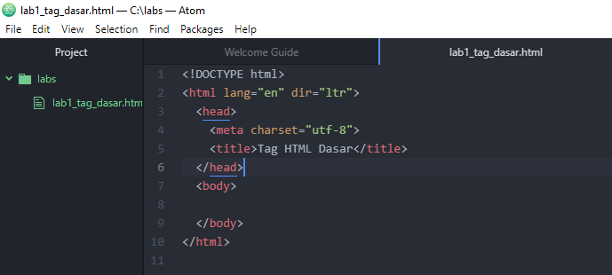

Dan ini tampilannya di browser

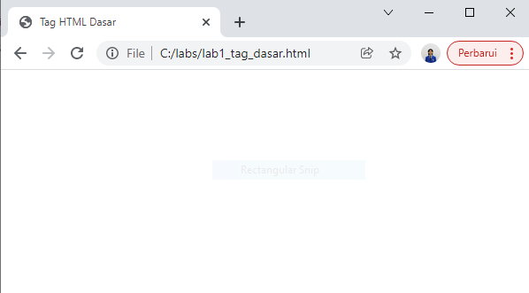

### Membuat paragraf
Untu membuat paragraf pada HTML, menggunakan tag **
**
Ini tampilannya

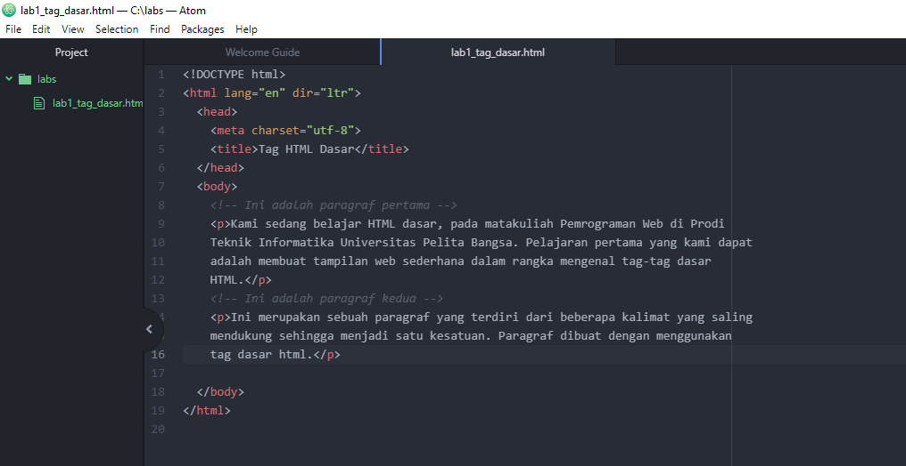

Dan ini tampilannya di browser

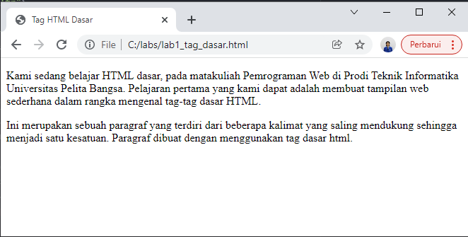

Menyisipkan align=”center” dan align=”right” pada tag **
**

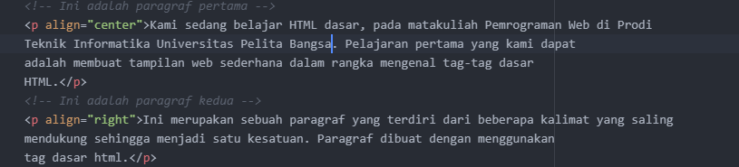

Dan ini hasilnya

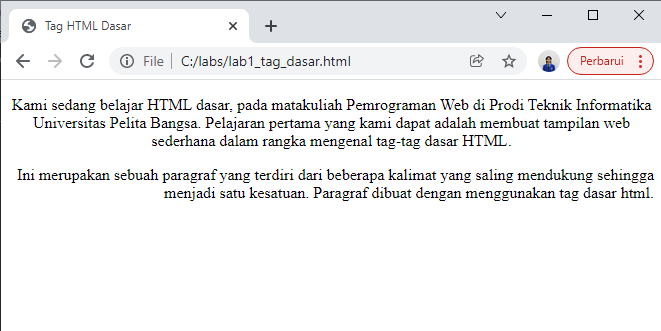

### Menambahkan Judul
Untuk judul paragraf pertama menggunakan tag <h1> dan untuk judul paragraf yang kedua menggunakan tag <h2>
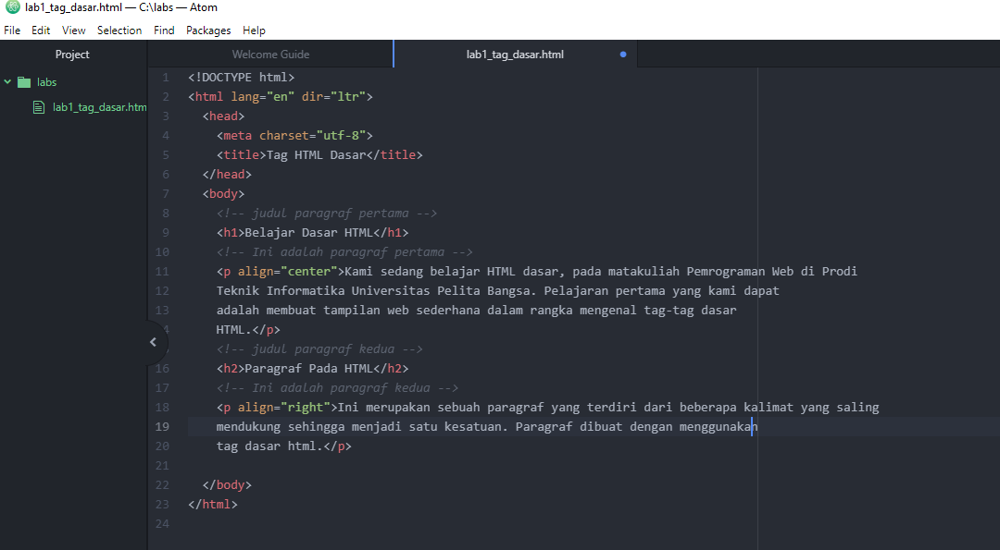

Ini tampilannya di browser
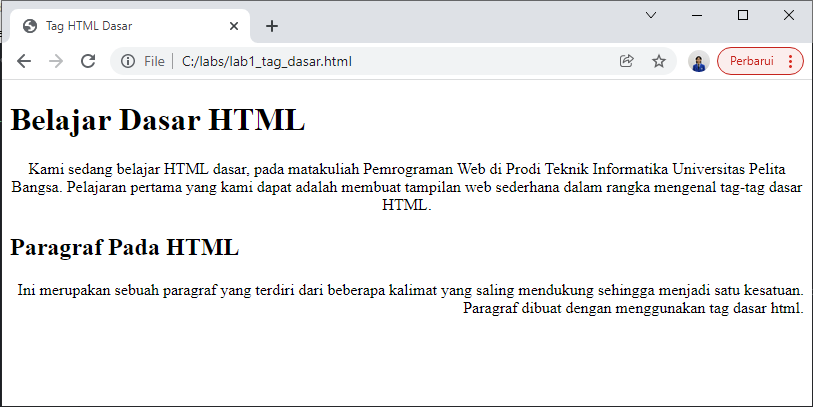

Terlihat perbedaanya, judul yang pertama lebih besar dari judul yang kedua.

### Memformat teks
Agar background teks menjadi warna kuning menggunakan tag <mark></mark>
Agar teks menjadi tebal menggunakan tag <b></b>
Agar teks menjadi miring menggunakan tag <i></i>
Agar teks mempunyai garis bawah menggunakan tag <u></u>

Ini gambarnya

Dan ini tampilannya di browser
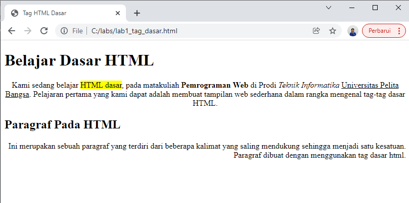

###  Menyisipkan Gambar
Simpan file gambar di folder web1lab1
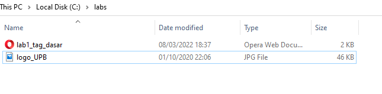

Sebelumnya tambahkan dulu judul dengan menggunakan tag <h3></h3>

Untuk bisa Menyisipkan gambar menggunakan tag 
di dalam tag  tersebut di sertakan src kemudian di isi nama file gambar.
Di sertakan juga width dan height untuk mengatur lebar dan panjang gambar.
Dan si sertakan title="Logo Universitas Pelita Bangsa" agar ketika gambar tidak muncul akan muncul tulisan Logo Universitas Pelita Bangsa.
Ini contoh kodingannya
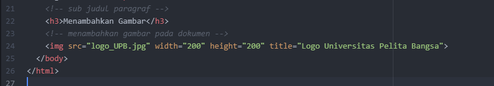

Dan ini tampilannya di browser
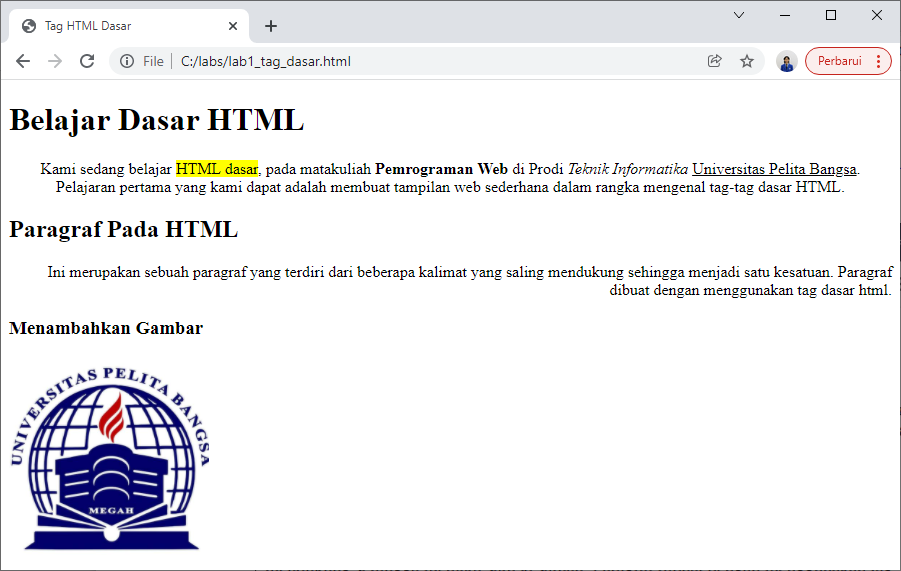

### Menambahkan Hyperlink
Untuk menambahkan link navigasi menggunakan tag 
di dalam tag tersebut terdapat href yang diisi oleh nama file, kemudian di antara tag  diisi dengan nama link yang ingin digunakan. Dan tag  tersebut di buungkus oleh tag <nav></nav> kemudian dibawahnya ditambah tag 
 agar muncul garis lurus.
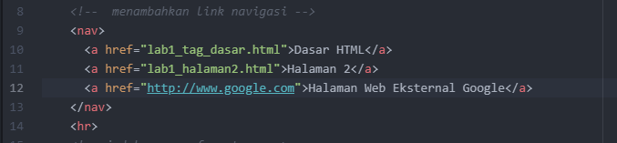

Dan ini tampilannya di browser
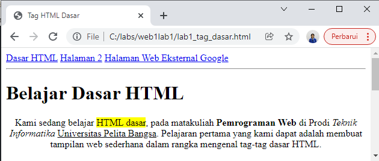

### Jawab Pertanyaan Berikut
1. Lakukan perubahan pada kode sesuai dengan keinginan anda, amati perubahannya adakah
   error ketika terjadi kesalahan penulisan tag?
   Jawab :

2. Apa perbedaan dari tag "
" dengan tag " ", berikan penjelasannya!
    Jawab : Tag 
 merupakan tag untuk menuliskan paragraf, sedangkan tag   untuk membuat garis baru.

3. Apa perbedaan atribut title dan alt pada tag , berikan penjelasannya!
    Jawab : atribut title merupakan tag ketika di sorot oleh mouse akan muncul tulisan yang diisi pada atribut title, namun tidak muncul ketika tidak disorot oleh mouse.
    Sedangkan atribut alt untuk mengetahui user ketika gambar tidak muncul akan muncul tulisan yang diisi pada atribut alt, contohnya Logo Universitas Pelita Bangsa
4. Untuk mengatur ukuran gambar, digunakan atribut width dan height. Agar tampilan gambar
    proporsional sebaiknya kedua atribut tersebut diisi semua atau tidak? Berikan penjelasannya!
    Jawab : sebaiknya harus diisi semuanya agar gambar menjadi lebih enak dilihat. Karena ukuran gambarnya sudak di atur.
5. Pada link tambahkan atribut target dengan nilai atribut bervariasi ( _blank, _self, _top,
    _parent ), apa yang terjadi pada masing-masing nilai antribut tersebut?
    Jawab :
    -Ketika atribut target diisi _blank, maka yang terjadi ketika kita mngklik link tersebut akan membuka tab baru.
    -Ketika atribut target diisi _self,  maka yang terjadi ketika kita mngklik link tersebut akan membuka di tab tersebut.
    -Ketika atribut target diisi _top,  maka yang terjadi ketika kita mngklik link tersebut masih akan membuka di tab baru dengan  layar penuh.
    -Ketika atribut target diisi _parent,  maka yang terjadi ketika kita mngklik link tersebut browser akan menampilkan semua dokumen yang dilink ke parent frame.
